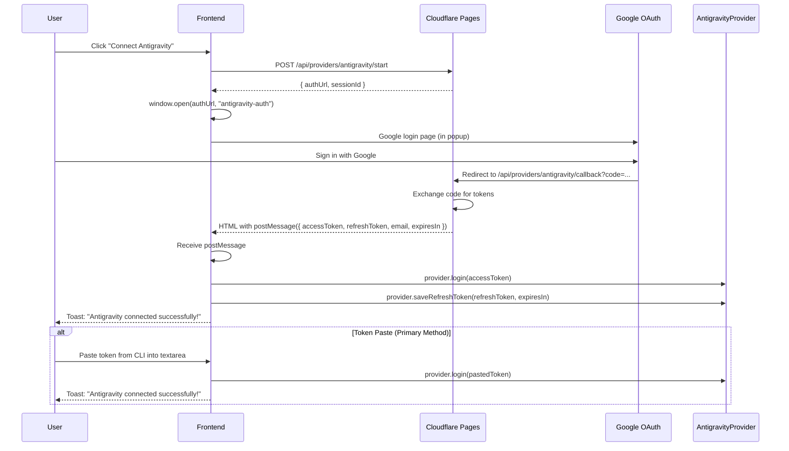
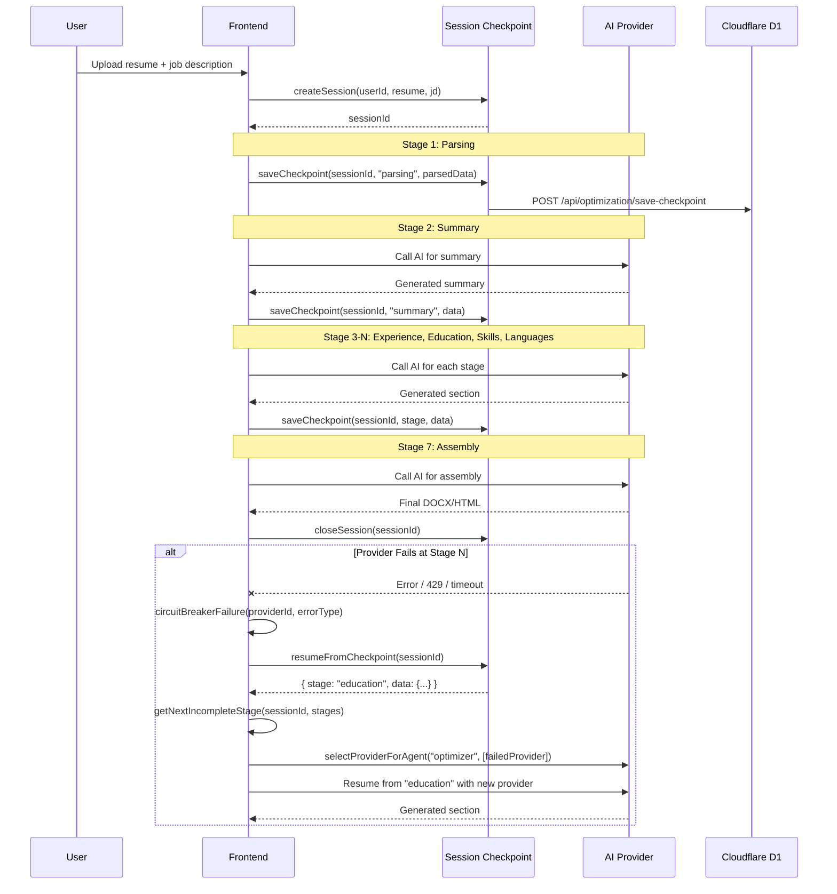
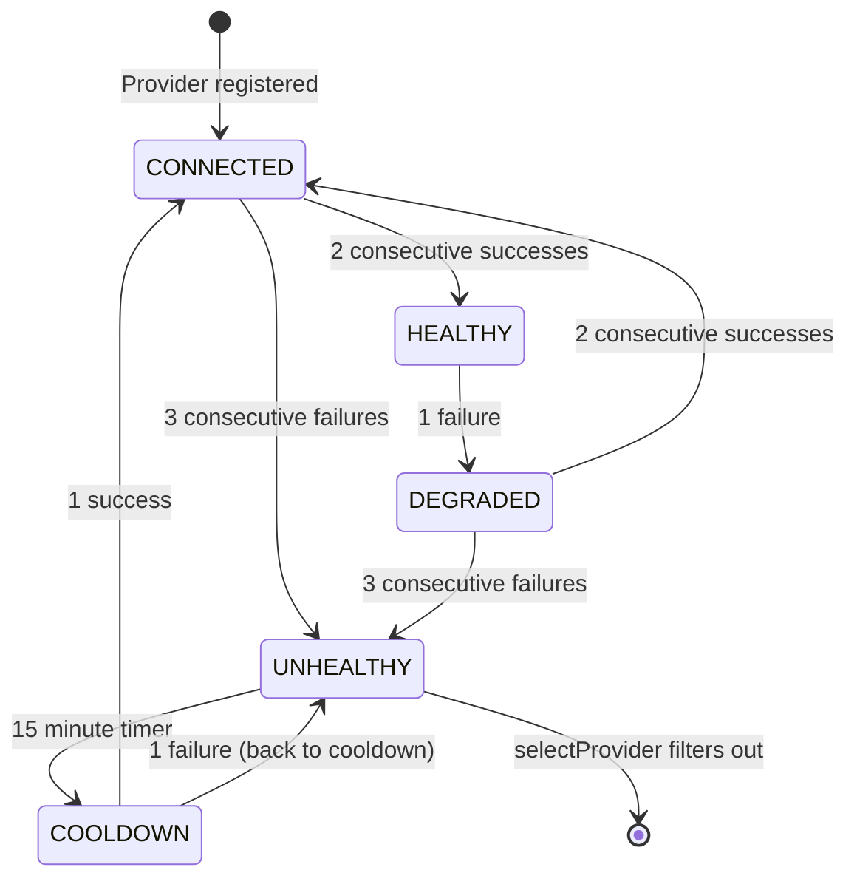

# SESSION_FLOW.md — Authentication & Optimization Session Flows

## 1. Antigravity Token Flow



## 2. Optimization Session Flow



## 3. Circuit Breaker Flow



## 4. Provider Selection Flow

```mermaid
flowchart TD
    A[Request AI call] --> B{Agent type?}
    B -->|optimizer| C[Filter: Tier 1-2 available providers]
    B -->|supervisor/guardian/assembler| D[Filter: Tier 2-3 available providers]
    B -->|emergency| E[Filter: Tier 4 only]

    C --> F{User default provider set?}
    D --> F
    E --> F

    F -->|Yes| G[Use default]
    F -->|No| H[Pick highest priority (lowest number)]

    G --> I{Provider healthy?}
    H --> I

    I -->|Yes| J[Call AI]
    I -->|No| K[Skip to next available]

    K --> L{More providers?}
    L -->|Yes| M[Pick next highest priority]
    M --> I
    L -->|No| N[Fallback: local engine]
    N --> O[Return degraded result]
```
